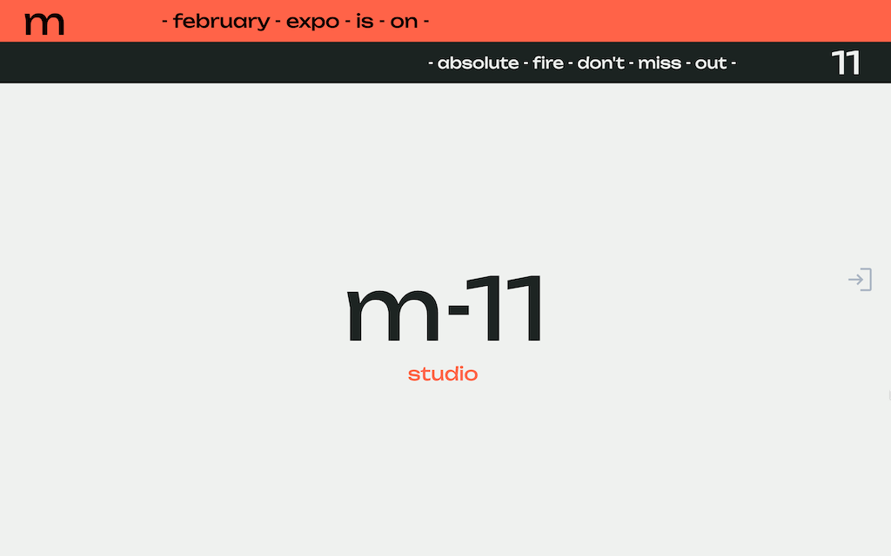
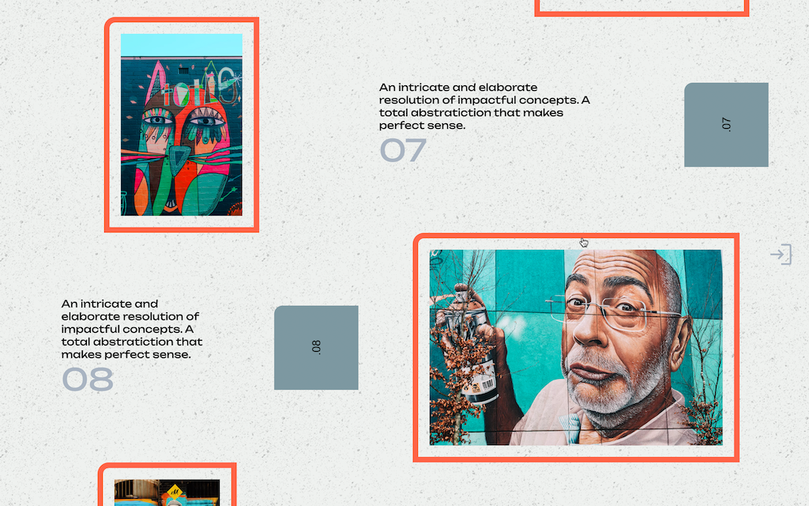
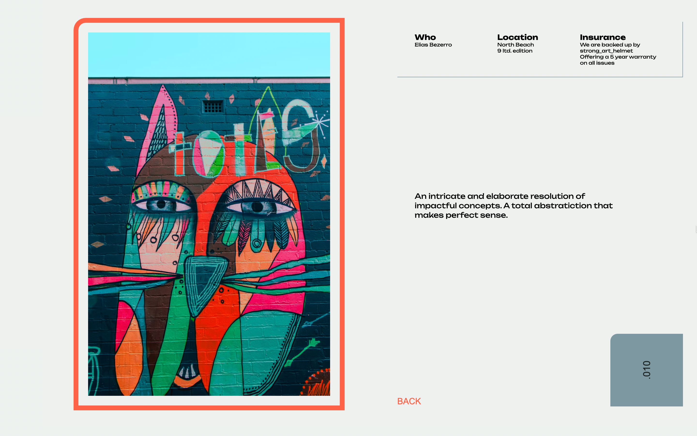

# M-11 STUDIO

E-commerce for wall/street art lovers. Built for MLH 48hrs Hackathon.

[LIVE MVP HERE](https://www.m11.design/)








---

## The Story:

Third time participating on a hackathon, this time solo. The theme is E-commerce, and I knew right away I wanted nothing that looks or feels like any of the main stream apps.
As a minimalist, I purchase quality over quantity, I enjoy clean experiences, and wanted to translate that by stepping out of my comfort zone with this design.
The goal is to provide the user with unpolluted visuals,and systematic engagement with a purpose.

## The Results

Full stack app, with security taken into account:

- Secured HTTP Headers
- Rate limit against Brute force attacks
- Data sanitization against NOSQL Query Injection
- Preventing params/query polution
- Protection against XSS

Payments processed with Stripe

Email notification integration with twilio's sendgrid and nodemailer

State management with React-Redux and Redux-Toolkit

Real-time chat via sockets for Customer Services

## Compromises:

- No focus on mobile UI although current MVP is mobile-friendly

## Tech Stack

- Frontend
  - React/ VITE
  - CSS
- Backend
  - NodeJS
  - Express.js
- Database
  - MongoDB: mongoose applied
- Deployment
  - Render.io
- Extras
  - Stripe
  - Nodemailer
  - Twilio's Sendgrid
  - React Redux
  - Redux Toolkit
  - Socket.io
  - Socket.io-client

## What's next

- Cart Times
- Auto Clear Inactive Cart
- Auto Restock products from inactive carts

## Running it

- Fork/Clone this project
- `.env` example:

```
NODE_ENV=development or production
DB_URI=YourURI
GRID_USERNAME=sendgridusername
GRID_PASSWORD=sendgridpassword
EMAIL: some@email.com
STRIPE_KEY: your_secret_key
```

- Run `npm install` at the root to install server dependencies
- `cd client` && `npm install` to install client dependencies
- At the root, `npm run dev` to start the API
- At the root `npm run dev-client` to start the client dev env
